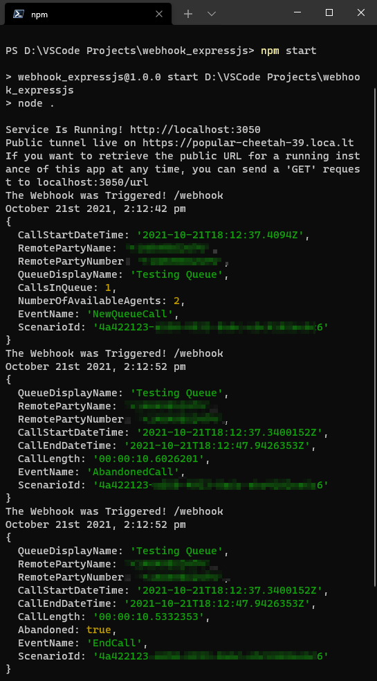

# webhook_expressjs

Just a simple ExpressJS app that opens up a server on localhost:3050 and uses the localtunnel API to automatically create a publicly accessible tunnel link to the app. It was created as a way to accept incoming webhooks on your local machine as an alternative to creating Microsoft PowerAutomate Flows or relying on something like RequestBin & Pipedream.

### Preview

### Machine Prerequisites
1. Git `https://git-scm.com/` (To pull the code from the Github Repository)
2. Node `https://nodejs.org/en/download/` (To host/run the app on your local machine)

## Installation
1. Navigate into a folder of your choice.
2. Open your terminal of choice in the directory (on Windows, you can simply shift + right-click and select "Open Powershell Window Here")
3. Execute `git clone https://github.com/MStoltzfus/webhook_expressjs/`
4. Navigate to newly created folder using `cd webhook_expressjs`
5. Execute `npm install` (This will download the node packages that this project depends on to run; failing to do this will result in module errors when you attempt to launch the app in the next step)
6. Execute `npm start` (launches the Express.JS app)

Connection URLs for both local and public connections to the app will be displayed upon successful launch of the app in your console.

## Usage options

The following URL endpoints are available

<table width="100%">
	<!-- why, markdown... -->
	<thead>
		<tr>
			<th width="15%">URL Route</th>
            <th width="10%">HTTP Verb</th>
			<th width="75%">Description</th>
            <th>
		</tr>
	<thead>
	<tbody>
		<tr>
			<td><code>"/"</code></td>
            <td><code>GET</code></td>
			<td>Gives a simple text response</td>
		</tr>
		<tr>
			<td><code>"/"</code></td>
            <td><code>POST</code></td>
			<td>Sends an immediate response to a request with a JSON payload and console logs the parsed JSON to the console in which the app is running</td>
		</tr>
		<tr>
			<td><code>"/webhook"</code></td>
            <td><code>GET</code></td>
			<td>Gives a simple text response</td>
		</tr>
        <tr>
			<td><code>"/webhook"</code></td>
            <td><code>POST</code></td>
			<td>Sends an immediate response to a request with a JSON payload and console logs the parsed JSON to the console in which the app is running</td>
		</tr>
        <tr>
			<td><code>"/url"</code></td>
            <td><code>GET</code></td>
			<td>Responds with the public localtunnel URL (implemented to solve the first-world problem of not wanting to scroll all the way to the top of the console to get it)</td>
		</tr>
	</tbody>
</table>

## App Package Dependencies
- Access to the internet to establish a localtunnel connection.
- npm package `express` (base framework for the app)
- npm package `localtunnel` (API used to automatically create a tunnel to application at launch)
- npm package `moment` (used to display a pretty timestamp when a POST request is made)
- npm package `nodemon` (dev dependency - hot reloads the Node server when editing the code)

## Credits
Microsoft PowerAutomate and PipeDream bugs which gave me the motivation to learn a new backend framework so I could stop relying on them for testing simple webhooks.
